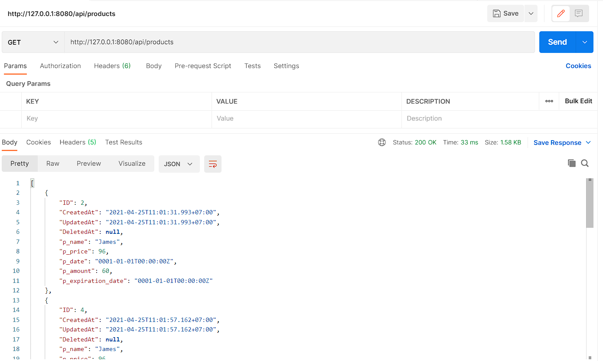
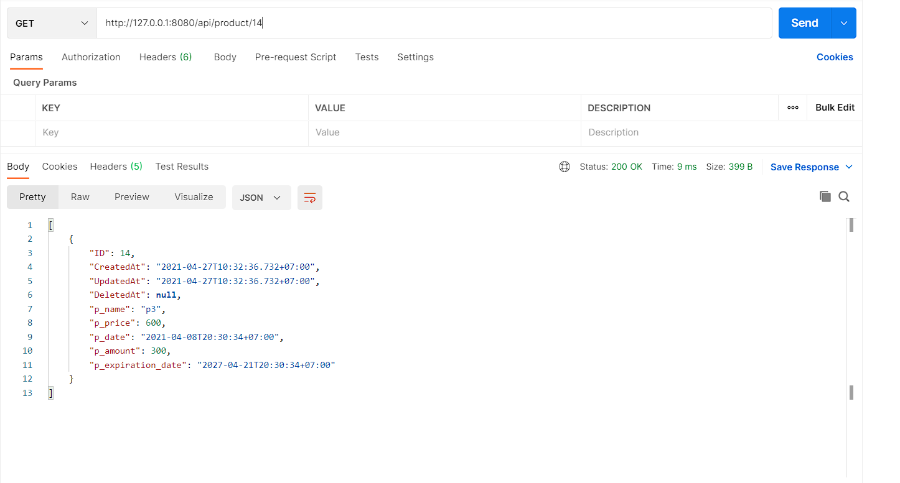
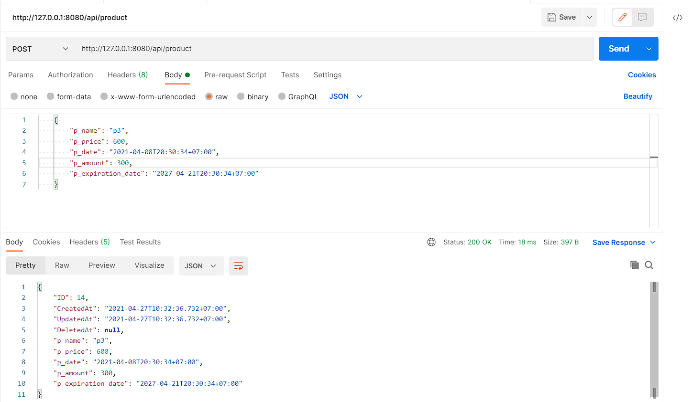
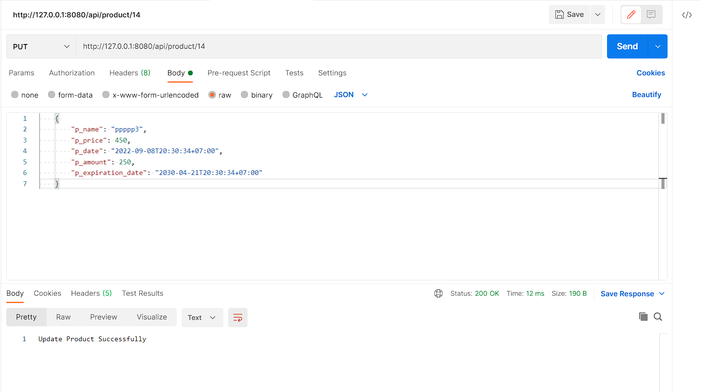
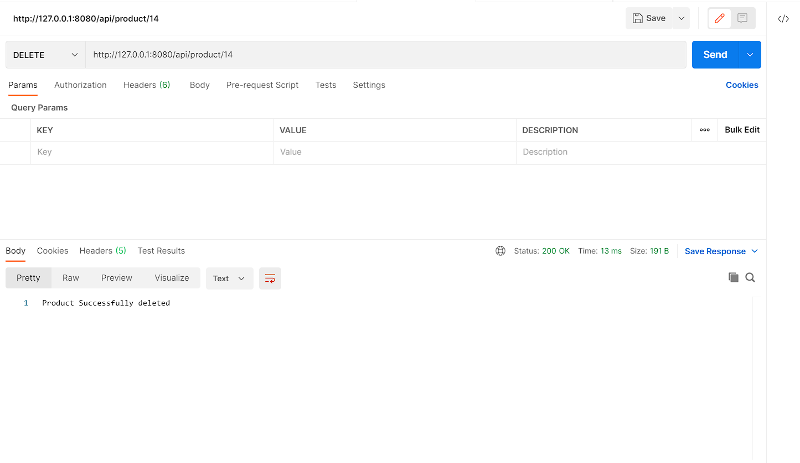

# CRUD & Fibergo & GORM

## Default Port

- http://127.0.0.1:8080

### Get All Data

- http://127.0.0.1:8080/api/products



### Get Data By Id

- http://127.0.0.1:8080/api/product/14



### Create Data

- http://127.0.0.1:8080/api/product

#### Json Data

```js
    {
        "p_name": "p3",
        "p_price": 600,
        "p_date": "2021-04-08T20:30:34+07:00",
        "p_amount": 300,
        "p_expiration_date": "2027-04-21T20:30:34+07:00"
    }
```



### Update Data

- http://127.0.0.1:8080/api/product/14

### Json Data

```js
    {
        "p_name": "ppppp3",
        "p_price": 450,
        "p_date": "2022-09-08T20:30:34+07:00",
        "p_amount": 250,
        "p_expiration_date": "2030-04-21T20:30:34+07:00"
    }
```



### Delete Data

- http://127.0.0.1:8080/api/product/14


